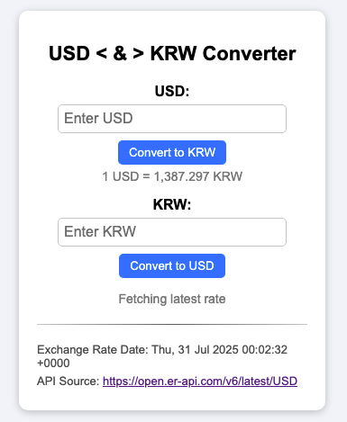

# web-converter
USD ↔ KRW Currency Web Converter

A simple web application that converts between **USD and KRW** using **real-time exchange rates** from an online API.

## 🚀 Features

- Convert USD to KRW and vice versa
- Fetches **live exchange rates** from `open.er-api.com`
- Displays:
  - 📅 Exchange rate date (UTC)
  - 🌐 API source URL
- Responsive and clean UI
- No backend required — 100% client-side

## 🧪 Live Exchange Rate API

This app uses the free endpoint:

```
https://open.er-api.com/v6/latest/USD
```

- No API key is required.

